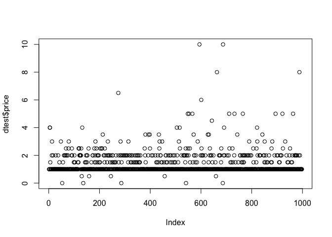
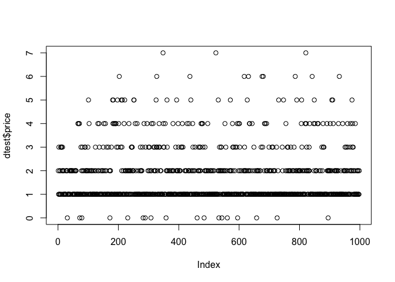
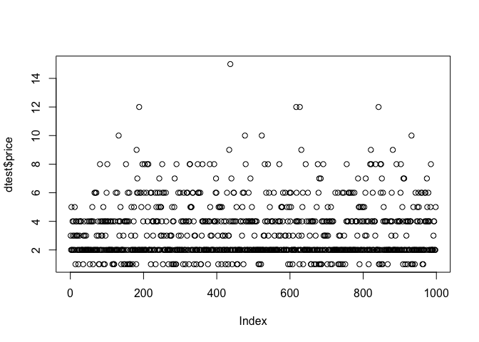
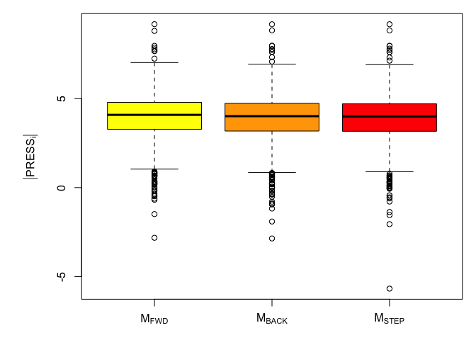
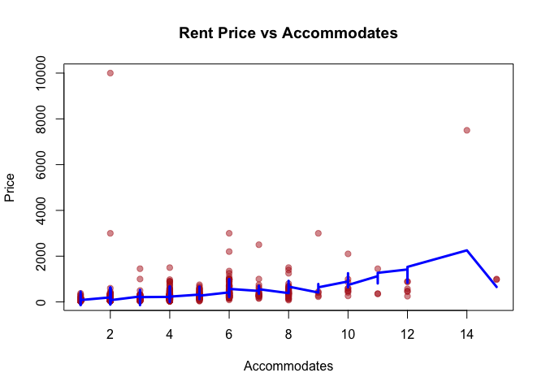
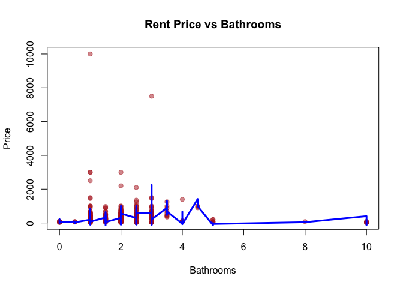

Linear Model Prediction
================
Sang Heon Lee

-   UW ID: 20581451

# Summary

## Preprocessing

### Transformation (if any)

-   None

### New Variables

<!-- List all variables/predictors added to dtrain and dtest  -->

-   None

## Model Building

Forward selection using step function

Main function used: step()

## Final Model

<!-- formula in your lm function  -->

-   The final model is *p**r**i**c**e*∼ accommodates + property\_type +
    latitude + extra\_people + room\_type + bathrooms +
    accommodates:latitude + latitude:extra\_people +
    accommodates:bathrooms + latitude:bathrooms

<!-- Details -->
<!-- R code starts, please present both code and output. -->
<!-- Provide descriptions and explanations to justify your operations -->
<!-- Be brief and to the point. -->
<!-- Only details lead to your final model are needed. If you tried other appoaches/models, you can mention them, no details needed for abandoned attempts. -->

# 1. Preprocessing

## 1.1 Loading data

First, we load our data.

    set.seed(20581451)
    load("linear.Rdata")

Take a look at the class of each columns to do any transformations if
needed.

    sapply(dtest, class)

    ##              Id        latitude       longitude   property_type       room_type 
    ##       "integer"       "numeric"       "numeric"        "factor"        "factor" 
    ##    accommodates       bathrooms            beds        bed_type guests_included 
    ##       "integer"       "numeric"       "integer"        "factor"       "integer" 
    ##    extra_people 
    ##       "numeric"

The below is the summary of the dtest data set.

    summary(dtest)

    ##        Id           latitude       longitude          property_type
    ##  Min.   :  1.0   Min.   :38.94   Min.   :-76.83   Apartment  :406  
    ##  1st Qu.:250.2   1st Qu.:38.99   1st Qu.:-76.76   House      :294  
    ##  Median :499.5   Median :39.00   Median :-76.75   Condominium:129  
    ##  Mean   :499.5   Mean   :39.00   Mean   :-76.75   Guest suite: 63  
    ##  3rd Qu.:748.8   3rd Qu.:39.02   3rd Qu.:-76.73   Townhouse  : 22  
    ##  Max.   :998.0   Max.   :39.04   Max.   :-76.71   Loft       : 21  
    ##                                                   (Other)    : 63  
    ##            room_type    accommodates      bathrooms           beds      
    ##  Entire home/apt:607   Min.   : 1.000   Min.   : 0.000   Min.   :0.000  
    ##  Hotel room     : 10   1st Qu.: 2.000   1st Qu.: 1.000   1st Qu.:1.000  
    ##  Private room   :359   Median : 2.000   Median : 1.000   Median :1.000  
    ##  Shared room    : 22   Mean   : 3.177   Mean   : 1.381   Mean   :1.747  
    ##                        3rd Qu.: 4.000   3rd Qu.: 1.500   3rd Qu.:2.000  
    ##                        Max.   :15.000   Max.   :10.000   Max.   :7.000  
    ##                                                                         
    ##           bed_type   guests_included  extra_people   
    ##  Airbed       :  6   Min.   :1.000   Min.   :  0.00  
    ##  Couch        :  2   1st Qu.:1.000   1st Qu.:  0.00  
    ##  Futon        : 11   Median :1.000   Median : 10.00  
    ##  Pull-out Sofa:  6   Mean   :1.846   Mean   : 21.23  
    ##  Real Bed     :973   3rd Qu.:2.000   3rd Qu.: 29.50  
    ##                      Max.   :9.000   Max.   :300.00  
    ## 

Use pair plot to see any relationship between variables.

    dev.new(width=10, height=10)

    pairs(dtest, pch = 16, cex=0.4)

Let’s plot to see relationship between response and important
explanatory variables

    plot(dtest$bathrooms, dtest$price)

<!-- -->

    plot(dtest$beds, dtest$price)

<!-- -->

    plot(dtest$accommodates, dtest$price)

<!-- -->

When i was looking at the above plots, it was very hard to determine the
relationship between following variables and price. But from common
knowledge i could guess that the mentioned varaibles: accommodates,
bathrooms, and beds are key factor in determining the price.

# 2. Model Building

The model building is done with step function.

First, we need a inital starting model named M0. And out max model named
Mmax. We start with the following Mmax and check if any coeffifnients
are NA

    M0 <- lm(price ~ 1, data = dtrain)
    Mmax <- lm(price ~ (.)^2, data = dtrain)
    anyNA(coef(Mmax))

    ## [1] TRUE

    beta.Max <- coef(Mmax)
    names(beta.Max)[is.na(beta.Max)]

    ##   [1] "latitude:property_typeCastle"                         
    ##   [2] "latitude:property_typeEarth house"                    
    ##   [3] "latitude:property_typeOther"                          
    ##   [4] "latitude:property_typeResort"                         
    ##   [5] "longitude:property_typeCastle"                        
    ##   [6] "longitude:property_typeEarth house"                   
    ##   [7] "longitude:property_typeOther"                         
    ##   [8] "longitude:property_typeResort"                        
    ##   [9] "longitude:bed_typeReal Bed"                           
    ##  [10] "property_typeApartment:room_typeHotel room"           
    ##  [11] "property_typeBed and breakfast:room_typeHotel room"   
    ##  [12] "property_typeBungalow:room_typeHotel room"            
    ##  [13] "property_typeCastle:room_typeHotel room"              
    ##  [14] "property_typeCondominium:room_typeHotel room"         
    ##  [15] "property_typeCottage:room_typeHotel room"             
    ##  [16] "property_typeEarth house:room_typeHotel room"         
    ##  [17] "property_typeGuest suite:room_typeHotel room"         
    ##  [18] "property_typeGuesthouse:room_typeHotel room"          
    ##  [19] "property_typeHouse:room_typeHotel room"               
    ##  [20] "property_typeLoft:room_typeHotel room"                
    ##  [21] "property_typeOther:room_typeHotel room"               
    ##  [22] "property_typeResort:room_typeHotel room"              
    ##  [23] "property_typeTownhouse:room_typeHotel room"           
    ##  [24] "property_typeCastle:room_typePrivate room"            
    ##  [25] "property_typeCottage:room_typePrivate room"           
    ##  [26] "property_typeEarth house:room_typePrivate room"       
    ##  [27] "property_typeGuesthouse:room_typePrivate room"        
    ##  [28] "property_typeOther:room_typePrivate room"             
    ##  [29] "property_typeResort:room_typePrivate room"            
    ##  [30] "property_typeServiced apartment:room_typePrivate room"
    ##  [31] "property_typeTownhouse:room_typePrivate room"         
    ##  [32] "property_typeBed and breakfast:room_typeShared room"  
    ##  [33] "property_typeBoutique hotel:room_typeShared room"     
    ##  [34] "property_typeBungalow:room_typeShared room"           
    ##  [35] "property_typeCastle:room_typeShared room"             
    ##  [36] "property_typeCondominium:room_typeShared room"        
    ##  [37] "property_typeCottage:room_typeShared room"            
    ##  [38] "property_typeEarth house:room_typeShared room"        
    ##  [39] "property_typeGuest suite:room_typeShared room"        
    ##  [40] "property_typeGuesthouse:room_typeShared room"         
    ##  [41] "property_typeHostel:room_typeShared room"             
    ##  [42] "property_typeHotel:room_typeShared room"              
    ##  [43] "property_typeHouse:room_typeShared room"              
    ##  [44] "property_typeLoft:room_typeShared room"               
    ##  [45] "property_typeOther:room_typeShared room"              
    ##  [46] "property_typeResort:room_typeShared room"             
    ##  [47] "property_typeServiced apartment:room_typeShared room" 
    ##  [48] "property_typeTownhouse:room_typeShared room"          
    ##  [49] "property_typeCastle:accommodates"                     
    ##  [50] "property_typeCottage:accommodates"                    
    ##  [51] "property_typeEarth house:accommodates"                
    ##  [52] "property_typeOther:accommodates"                      
    ##  [53] "property_typeResort:accommodates"                     
    ##  [54] "property_typeTownhouse:accommodates"                  
    ##  [55] "property_typeBungalow:bathrooms"                      
    ##  [56] "property_typeCastle:bathrooms"                        
    ##  [57] "property_typeCottage:bathrooms"                       
    ##  [58] "property_typeEarth house:bathrooms"                   
    ##  [59] "property_typeGuesthouse:bathrooms"                    
    ##  [60] "property_typeOther:bathrooms"                         
    ##  [61] "property_typeResort:bathrooms"                        
    ##  [62] "property_typeTownhouse:bathrooms"                     
    ##  [63] "property_typeBungalow:beds"                           
    ##  [64] "property_typeCastle:beds"                             
    ##  [65] "property_typeCottage:beds"                            
    ##  [66] "property_typeEarth house:beds"                        
    ##  [67] "property_typeOther:beds"                              
    ##  [68] "property_typeResort:beds"                             
    ##  [69] "property_typeTownhouse:beds"                          
    ##  [70] "property_typeApartment:bed_typeCouch"                 
    ##  [71] "property_typeBed and breakfast:bed_typeCouch"         
    ##  [72] "property_typeBoutique hotel:bed_typeCouch"            
    ##  [73] "property_typeBungalow:bed_typeCouch"                  
    ##  [74] "property_typeCastle:bed_typeCouch"                    
    ##  [75] "property_typeCondominium:bed_typeCouch"               
    ##  [76] "property_typeCottage:bed_typeCouch"                   
    ##  [77] "property_typeEarth house:bed_typeCouch"               
    ##  [78] "property_typeGuest suite:bed_typeCouch"               
    ##  [79] "property_typeGuesthouse:bed_typeCouch"                
    ##  [80] "property_typeHostel:bed_typeCouch"                    
    ##  [81] "property_typeHotel:bed_typeCouch"                     
    ##  [82] "property_typeHouse:bed_typeCouch"                     
    ##  [83] "property_typeLoft:bed_typeCouch"                      
    ##  [84] "property_typeOther:bed_typeCouch"                     
    ##  [85] "property_typeResort:bed_typeCouch"                    
    ##  [86] "property_typeServiced apartment:bed_typeCouch"        
    ##  [87] "property_typeTownhouse:bed_typeCouch"                 
    ##  [88] "property_typeBed and breakfast:bed_typeFuton"         
    ##  [89] "property_typeBoutique hotel:bed_typeFuton"            
    ##  [90] "property_typeBungalow:bed_typeFuton"                  
    ##  [91] "property_typeCastle:bed_typeFuton"                    
    ##  [92] "property_typeCondominium:bed_typeFuton"               
    ##  [93] "property_typeCottage:bed_typeFuton"                   
    ##  [94] "property_typeEarth house:bed_typeFuton"               
    ##  [95] "property_typeGuesthouse:bed_typeFuton"                
    ##  [96] "property_typeHostel:bed_typeFuton"                    
    ##  [97] "property_typeHotel:bed_typeFuton"                     
    ##  [98] "property_typeLoft:bed_typeFuton"                      
    ##  [99] "property_typeOther:bed_typeFuton"                     
    ## [100] "property_typeResort:bed_typeFuton"                    
    ## [101] "property_typeServiced apartment:bed_typeFuton"        
    ## [102] "property_typeTownhouse:bed_typeFuton"                 
    ## [103] "property_typeBed and breakfast:bed_typePull-out Sofa" 
    ## [104] "property_typeBoutique hotel:bed_typePull-out Sofa"    
    ## [105] "property_typeBungalow:bed_typePull-out Sofa"          
    ## [106] "property_typeCastle:bed_typePull-out Sofa"            
    ## [107] "property_typeCottage:bed_typePull-out Sofa"           
    ## [108] "property_typeEarth house:bed_typePull-out Sofa"       
    ## [109] "property_typeGuest suite:bed_typePull-out Sofa"       
    ## [110] "property_typeGuesthouse:bed_typePull-out Sofa"        
    ## [111] "property_typeHostel:bed_typePull-out Sofa"            
    ## [112] "property_typeHotel:bed_typePull-out Sofa"             
    ## [113] "property_typeHouse:bed_typePull-out Sofa"             
    ## [114] "property_typeLoft:bed_typePull-out Sofa"              
    ## [115] "property_typeOther:bed_typePull-out Sofa"             
    ## [116] "property_typeResort:bed_typePull-out Sofa"            
    ## [117] "property_typeServiced apartment:bed_typePull-out Sofa"
    ## [118] "property_typeTownhouse:bed_typePull-out Sofa"         
    ## [119] "property_typeApartment:bed_typeReal Bed"              
    ## [120] "property_typeBed and breakfast:bed_typeReal Bed"      
    ## [121] "property_typeBoutique hotel:bed_typeReal Bed"         
    ## [122] "property_typeBungalow:bed_typeReal Bed"               
    ## [123] "property_typeCastle:bed_typeReal Bed"                 
    ## [124] "property_typeCondominium:bed_typeReal Bed"            
    ## [125] "property_typeCottage:bed_typeReal Bed"                
    ## [126] "property_typeEarth house:bed_typeReal Bed"            
    ## [127] "property_typeGuest suite:bed_typeReal Bed"            
    ## [128] "property_typeGuesthouse:bed_typeReal Bed"             
    ## [129] "property_typeHostel:bed_typeReal Bed"                 
    ## [130] "property_typeHotel:bed_typeReal Bed"                  
    ## [131] "property_typeHouse:bed_typeReal Bed"                  
    ## [132] "property_typeLoft:bed_typeReal Bed"                   
    ## [133] "property_typeOther:bed_typeReal Bed"                  
    ## [134] "property_typeResort:bed_typeReal Bed"                 
    ## [135] "property_typeServiced apartment:bed_typeReal Bed"     
    ## [136] "property_typeTownhouse:bed_typeReal Bed"              
    ## [137] "property_typeBed and breakfast:guests_included"       
    ## [138] "property_typeBungalow:guests_included"                
    ## [139] "property_typeCastle:guests_included"                  
    ## [140] "property_typeCottage:guests_included"                 
    ## [141] "property_typeEarth house:guests_included"             
    ## [142] "property_typeHostel:guests_included"                  
    ## [143] "property_typeHotel:guests_included"                   
    ## [144] "property_typeOther:guests_included"                   
    ## [145] "property_typeResort:guests_included"                  
    ## [146] "property_typeTownhouse:guests_included"               
    ## [147] "property_typeBungalow:extra_people"                   
    ## [148] "property_typeCastle:extra_people"                     
    ## [149] "property_typeCottage:extra_people"                    
    ## [150] "property_typeEarth house:extra_people"                
    ## [151] "property_typeOther:extra_people"                      
    ## [152] "property_typeResort:extra_people"                     
    ## [153] "property_typeServiced apartment:extra_people"         
    ## [154] "property_typeTownhouse:extra_people"                  
    ## [155] "room_typeHotel room:bed_typeCouch"                    
    ## [156] "room_typePrivate room:bed_typeCouch"                  
    ## [157] "room_typeShared room:bed_typeCouch"                   
    ## [158] "room_typeHotel room:bed_typeFuton"                    
    ## [159] "room_typeHotel room:bed_typePull-out Sofa"            
    ## [160] "room_typePrivate room:bed_typePull-out Sofa"          
    ## [161] "room_typeShared room:bed_typePull-out Sofa"           
    ## [162] "room_typeHotel room:bed_typeReal Bed"                 
    ## [163] "room_typePrivate room:bed_typeReal Bed"               
    ## [164] "room_typeShared room:bed_typeReal Bed"                
    ## [165] "room_typeShared room:guests_included"                 
    ## [166] "accommodates:bed_typeCouch"                           
    ## [167] "accommodates:bed_typePull-out Sofa"                   
    ## [168] "accommodates:bed_typeReal Bed"                        
    ## [169] "bathrooms:bed_typeCouch"                              
    ## [170] "bathrooms:bed_typePull-out Sofa"                      
    ## [171] "bathrooms:bed_typeReal Bed"                           
    ## [172] "beds:bed_typeCouch"                                   
    ## [173] "beds:bed_typePull-out Sofa"                           
    ## [174] "beds:bed_typeReal Bed"                                
    ## [175] "bed_typeCouch:guests_included"                        
    ## [176] "bed_typePull-out Sofa:guests_included"                
    ## [177] "bed_typeReal Bed:guests_included"                     
    ## [178] "bed_typeCouch:extra_people"                           
    ## [179] "bed_typeFuton:extra_people"                           
    ## [180] "bed_typePull-out Sofa:extra_people"                   
    ## [181] "bed_typeReal Bed:extra_people"

There seems to be a lot of NA coefficients, we get rid of them by
factoring out useless interaction variables but still having its own
coefficients. I take out property\_type, room\_type, and bed\_type from
the interaction model and put as is. The result yields a max model
without NA coefficients. I am good to go to run the step function.

    Mmax <- lm(price ~ (.-property_type-room_type-bed_type)^2 + property_type + room_type + bed_type, data = dtrain)

    anyNA(coef(Mmax))

    ## [1] FALSE

    beta.Max <- coef(Mmax)
    names(beta.Max)[is.na(beta.Max)]

    ## character(0)

I declare Mstart which is used in stepwise selection method.

    Mstart <- lm(price ~ ., data = dtrain)

    system.time({ # time the calculation
      Mfwd <- step(object = M0, # starting point model
      scope = list(lower = M0, upper = Mmax), # smallest and largest model
      direction = "forward",
      k=2,
      trace = FALSE) # trace prints out information
    })

    ##    user  system elapsed 
    ##   0.199   0.020   0.220

    # backward elimiation
    system.time({
      Mback <- step(object = Mmax, # starting point model
      scope = list(lower = M0, upper = Mmax),
      k=2,
      direction = "backward", trace = FALSE)
    })

    ##    user  system elapsed 
    ##   0.887   0.064   0.952

    # stepwise selection (both directions)
    system.time({
      Mstep <- step(object = Mstart,
        scope = list(lower = M0, upper = Mmax),
          k=2, direction = "both", trace = FALSE)
    })

    ##    user  system elapsed 
    ##   1.042   0.087   1.128

These are the summary of three models generated from step with different
methods

    Mfwd$call

    ## lm(formula = price ~ accommodates + property_type + latitude + 
    ##     extra_people + room_type + bathrooms + accommodates:latitude + 
    ##     latitude:extra_people + accommodates:bathrooms + latitude:bathrooms, 
    ##     data = dtrain)

    Mback$call

    ## lm(formula = price ~ latitude + longitude + accommodates + bathrooms + 
    ##     beds + guests_included + extra_people + property_type + room_type + 
    ##     latitude:accommodates + latitude:guests_included + longitude:guests_included + 
    ##     longitude:extra_people + accommodates:bathrooms + accommodates:beds + 
    ##     accommodates:extra_people + bathrooms:extra_people + beds:guests_included + 
    ##     guests_included:extra_people, data = dtrain)

    Mstep$call

    ## lm(formula = price ~ latitude + longitude + property_type + room_type + 
    ##     accommodates + bathrooms + beds + guests_included + extra_people + 
    ##     accommodates:beds + beds:guests_included + guests_included:extra_people + 
    ##     latitude:accommodates + latitude:guests_included + accommodates:extra_people + 
    ##     accommodates:bathrooms + longitude:guests_included + longitude:extra_people + 
    ##     bathrooms:beds, data = dtrain)

Check the AIC and press residuals of each model and choose the best one.

    AIC1 <- AIC(Mfwd)
    AIC2 <- AIC(Mback)
    AIC3 <- AIC(Mstep)

    press1 <- resid(Mfwd)/(1-hatvalues(Mfwd)) # M1
    press2 <- resid(Mback)/(1-hatvalues(Mback)) # M2
    press3 <- resid(Mstep)/(1-hatvalues(Mstep))

    disp <- rbind(AIC = c(AIC1, AIC2, AIC3)
            , PRESS = c(sum(press1^2), sum(press2^2), sum(press3^2)))

    disp

    ##           [,1]    [,2]    [,3]
    ## AIC   21869.75 21823.7 21823.3
    ## PRESS      Inf     Inf     Inf

    Mnames <- expression(M[FWD], M[BACK], M[STEP])
    par(mar = c(3, 6, 1, 1))
    boxplot(x = list(log(abs(press1)), log(abs(press2)), log(abs(press3))), names = Mnames,
    ylab = expression(group("|", PRESS[i], "|")),
    col = c("yellow", "orange", "red"))

    ## Warning in bplt(at[i], wid = width[i], stats = z$stats[, i], out = z$out[z$group
    ## == : Outlier (Inf) in boxplot 1 is not drawn

    ## Warning in bplt(at[i], wid = width[i], stats = z$stats[, i], out = z$out[z$group
    ## == : Outlier (Inf) in boxplot 2 is not drawn

    ## Warning in bplt(at[i], wid = width[i], stats = z$stats[, i], out = z$out[z$group
    ## == : Outlier (Inf) in boxplot 3 is not drawn

<!-- -->

Model with forward step seems to be the best here. Therefore, I choose
this one as my model. Another reasoni chose Mfwd model is because of
simplicity. The other two models are really complicated and could lead
to overfitting.

The following is the result of the Mfwd model. I see strong significant
relationship between pricae and accommodates, latitude,
accommodates:latitude, and accommodates:bathrooms variables. I also see
significant relationship between price and extra\_people, room\_type,
and latitude:extra\_people variables.

    summary(Mfwd)

    ## 
    ## Call:
    ## lm(formula = price ~ accommodates + property_type + latitude + 
    ##     extra_people + room_type + bathrooms + accommodates:latitude + 
    ##     latitude:extra_people + accommodates:bathrooms + latitude:bathrooms, 
    ##     data = dtrain)
    ## 
    ## Residuals:
    ##     Min      1Q  Median      3Q     Max 
    ## -1280.7   -75.2   -12.0    42.5  9376.7 
    ## 
    ## Coefficients:
    ##                                   Estimate Std. Error t value Pr(>|t|)    
    ## (Intercept)                     -1.669e+05  3.795e+04  -4.398 1.17e-05 ***
    ## accommodates                     2.903e+04  8.465e+03   3.430 0.000620 ***
    ## property_typeApartment          -8.221e+01  1.835e+02  -0.448 0.654269    
    ## property_typeBed and breakfast  -2.486e+02  2.107e+02  -1.180 0.238348    
    ## property_typeBoutique hotel      3.710e+02  1.896e+02   1.957 0.050527 .  
    ## property_typeBungalow           -9.558e+01  2.425e+02  -0.394 0.693488    
    ## property_typeCastle             -1.128e+02  3.981e+02  -0.283 0.776910    
    ## property_typeCondominium        -3.378e+01  1.849e+02  -0.183 0.855048    
    ## property_typeCottage            -2.223e+01  2.738e+02  -0.081 0.935310    
    ## property_typeEarth house        -6.321e+01  3.960e+02  -0.160 0.873199    
    ## property_typeGuest suite        -8.287e+01  1.872e+02  -0.443 0.658039    
    ## property_typeGuesthouse         -6.593e+01  2.275e+02  -0.290 0.772023    
    ## property_typeHostel             -8.394e+01  2.044e+02  -0.411 0.681387    
    ## property_typeHotel               2.488e+01  1.929e+02   0.129 0.897401    
    ## property_typeHouse              -7.489e+01  1.840e+02  -0.407 0.684073    
    ## property_typeLoft                1.469e+01  1.988e+02   0.074 0.941117    
    ## property_typeOther              -6.174e+01  3.967e+02  -0.156 0.876360    
    ## property_typeResort              1.175e+02  3.956e+02   0.297 0.766536    
    ## property_typeServiced apartment  1.575e+02  2.034e+02   0.775 0.438721    
    ## property_typeTownhouse           2.793e+02  1.993e+02   1.401 0.161293    
    ## latitude                         4.285e+03  9.727e+02   4.405 1.13e-05 ***
    ## extra_people                    -1.159e+03  5.213e+02  -2.224 0.026313 *  
    ## room_typeHotel room             -2.091e+02  8.875e+01  -2.356 0.018611 *  
    ## room_typePrivate room           -2.331e+01  2.381e+01  -0.979 0.327590    
    ## room_typeShared room            -1.341e+02  6.855e+01  -1.957 0.050543 .  
    ## bathrooms                        4.487e+04  2.452e+04   1.830 0.067504 .  
    ## accommodates:latitude           -7.441e+02  2.171e+02  -3.428 0.000624 ***
    ## latitude:extra_people            2.974e+01  1.337e+01   2.225 0.026231 *  
    ## accommodates:bathrooms           2.979e+01  5.438e+00   5.478 5.05e-08 ***
    ## latitude:bathrooms              -1.152e+03  6.284e+02  -1.834 0.066921 .  
    ## ---
    ## Signif. codes:  0 '***' 0.001 '**' 0.01 '*' 0.05 '.' 0.1 ' ' 1
    ## 
    ## Residual standard error: 350.9 on 1470 degrees of freedom
    ## Multiple R-squared:  0.2273, Adjusted R-squared:  0.2121 
    ## F-statistic: 14.91 on 29 and 1470 DF,  p-value: < 2.2e-16

Now, i check the prediction of my model against the train set to see if
my model is acceptable.

    Xorder <- order(dtrain$accommodates)
    plot(dtrain$accommodates, dtrain$price,
    main = "Rent Price vs Accommodates",
    xlab = "Accommodates",
    ylab = "Price",
    pch=19,
    col=adjustcolor("firebrick", 0.5)
    )

    lines(dtrain$accommodates[Xorder],
      predict(Mfwd)[Xorder],
      col="blue", lwd=3)

<!-- -->

    Xorder <- order(dtrain$bathrooms)
    plot(dtrain$bathrooms, dtrain$price,
    main = "Rent Price vs Bathrooms",
    xlab = "Bathrooms",
    ylab = "Price",
    pch=19,
    col=adjustcolor("firebrick", 0.5)
    )

    lines(dtrain$bathrooms[Xorder],
      predict(Mfwd)[Xorder],
      col="blue", lwd=3)

<!-- -->

The plot and my prediction line seems to fit well.

# 3. Final Model

The final model from my analysis is: *p**r**i**c**e*∼ accommodates +
property\_type + latitude + extra\_people + room\_type + bathrooms +
accommodates:latitude + latitude:extra\_people + accommodates:bathrooms
+ latitude:bathrooms
